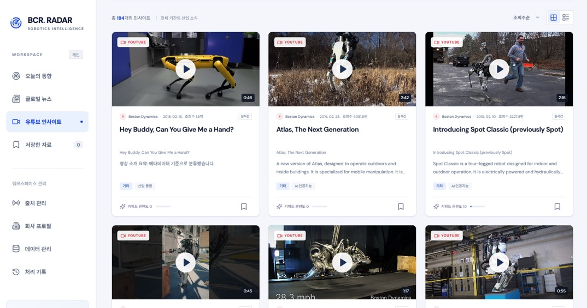
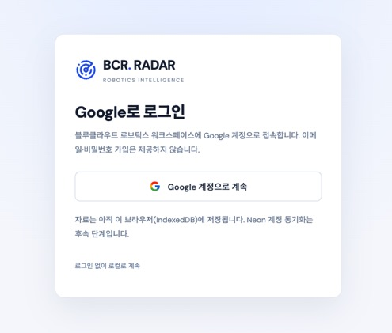
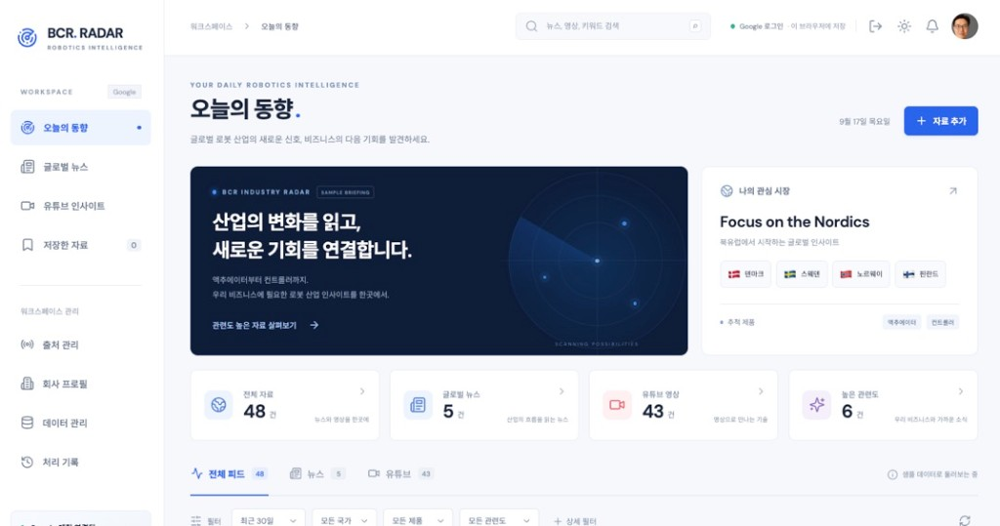

# BCR Robotics Radar





블루클라우드 로보틱스 북유럽 세일즈를 위한 미디어 허브입니다. 글로벌 로봇 뉴스·유튜브를 탐색하고, 액추에이터·컨트롤러 사업과 관련된 자료를 저장·메모합니다.

저장소: [junsang-dong/goorm-260917-news](https://github.com/junsang-dong/goorm-260917-news)

---

## 이번 작업 요약 (2026-09-19)

### 주요 구현

| 영역 | 내용 |
|---|---|
| 참고 출처 30개 | `xref/`의 로봇 뉴스 10개, 기업 공식 사이트 10개, YouTube 채널 10개를 출처 관리와 피드에 1회 자동 등록 |
| 인기 영상 수집 | YouTube 채널별 전체 기간 조회수 상위 12개를 우선 수집하고 최근 업로드로 최대 20개까지 보완 |
| 영상 메타데이터 | 실제 영상 ID, 고해상도 썸네일, 재생 시간, 조회수를 저장하고 피드에 표시 |
| 조회수순 피드 | 유튜브 인사이트 진입 시 전체 기간·조회수순으로 전환해 오래된 인기 영상도 노출 |
| 카드 내 재생 | 영상 썸네일을 누르면 현재 카드 위치에서 `youtube-nocookie.com` 플레이어로 즉시 재생 |
| GPT 분석 | OpenAI Responses API 구조화 출력으로 한국어 제목·요약·제품·국가·주제·관련도·영업 포인트 생성 |
| 클라우드 저장 | Vercel Functions에서 Firebase 토큰을 검증하고 Firebase UID별 워크스페이스를 Neon JSONB에 동기화 |
| 안전한 상태 확인 | 키 값을 노출하지 않고 YouTube·GPT 설정과 Neon `SELECT 1` 연결 상태만 반환 |

### 오류·보완 수정

- 채널 브리핑 카드가 개별 영상처럼 표시되던 문제 → 실제 영상 수집 후 영상 ID·썸네일이 있는 카드로 분리
- 최신 영상만으로 오래된 인기 영상이 보이지 않던 문제 → YouTube 검색을 `order=viewCount`로 변경하고 전체 기간 조회수 정렬 추가
- 첨부 목록의 `@TheRobotReport`가 영상 1개인 과거 채널로 연결되던 문제 → 다수 공식 영상이 있는 `@therobotreport7420`으로 교정
- 기존 7일 필터가 오래된 인기 영상을 숨기던 문제 → 유튜브 인사이트에서는 자동으로 전체 기간·조회수순 적용
- YouTube 썸네일 클릭 시 상세 창만 열리던 문제 → 카드 내부 인라인 플레이어로 전환
- GPT가 회사 관심 국가·제품을 콘텐츠 사실로 섞을 수 있던 문제 → 콘텐츠 태그와 회사 관련도 평가의 프롬프트 경계를 분리
- 테스트 환경에서 `import.meta.env`가 없을 때 초기화가 실패하던 문제 → 선택적 환경변수 접근으로 수정
- 워크스페이스 연결 확인 과정에서 데이터 전체를 조회할 위험 → 내용은 읽지 않고 `SELECT 1`만 수행하도록 변경
- 기존 사용자 저장소에 신규 출처가 반영되지 않던 문제 → 버전이 있는 IndexedDB 카탈로그 마이그레이션 추가

### 참고 데이터

- `xref/C46 REF1 ROBOT NEWS TOP10.csv`
- `xref/C46 REF2 ROBOT COMPANY TOP10.csv`
- `xref/C46 REF3 ROBOT YTB CH TOP10.csv`

---

## 클라우드 아키텍처 (2026-09-19)

앱은 로컬 우선 구조를 유지하면서 운영 모드의 서버 처리를 다음 계층으로 분리합니다.

| 계층 | 역할 |
|---|---|
| React · IndexedDB | 화면, 필터, 오프라인 캐시, 로컬 모드 |
| Vercel Serverless Functions | Firebase 토큰 검증, YouTube 프록시, GPT 분석, Neon 동기화 API |
| OpenAI Responses API | 한국어 요약, 제품·국가·주제 분류, 관련도·영업 검토 포인트 생성 |
| Neon PostgreSQL | Firebase UID별 워크스페이스 JSONB 원본과 낙관적 revision 저장 |
| Firebase Auth | Google 로그인과 서버 API 사용자 식별 |

`VITE_APP_MODE=local`에서는 기존 IndexedDB 방식으로 동작합니다. `cloud`에서는 로그인 후 Neon 데이터를 내려받아 로컬 캐시를 구성하고, 변경 사항을 서버로 동기화합니다. OpenAI·YouTube·Neon·Firebase Admin 비밀값은 모두 서버 환경변수에만 둡니다.

### API 경계

| 경로 | 역할 |
|---|---|
| `GET /api/v1/integrations/status` | YouTube·GPT·Neon 연결 상태 |
| `POST /api/v1/integrations/collect` | YouTube 채널·주제 수집 |
| `POST /api/v1/analysis` | GPT 구조화 분석 |
| `GET /api/v1/workspace` | 로그인 사용자의 Neon 워크스페이스 조회 |
| `PUT /api/v1/workspace` | revision 충돌 검사 후 워크스페이스 저장 |

수집·분석·워크스페이스 API는 운영 환경에서 Firebase ID 토큰을 요구합니다.

---

## 이전 작업 요약 (2026-09-17)

Codex에서 중단된 **단계 A 로컬 MVP**를 이어서 완성하고, **YouTube 수집(단계 B)** 과 **Firebase Google 로그인(단계 C 인증)** 까지 연결했습니다.

### 주요 구현

| 영역 | 내용 |
|---|---|
| 로컬 MVP | IndexedDB 저장, 피드·필터·상세, 북마크·메모, 샘플/수동 등록, JSON 백업·복원 |
| YouTube 수집 | `.env`의 `YOUTUBE_API_KEY`를 서버 전용으로 사용, `/api/v1/integrations/*` 프록시 |
| 주제 검색 | 액추에이터·컨트롤러·AI·인공지능 키워드로 영상 검색 수집 |
| Google 로그인 | Firebase `signInWithPopup`, `/login` 화면, 로그아웃 시 Query 캐시 정리 |
| UI | 블루·네이비 뉴스룸 레이아웃, 로컬/Google 상태 배지, 반응형 |

### 오류·보완 수정

- `App.tsx` JSX 문법 오류(`onAdd` 콜백 닫는 괄호 누락)로 빌드 실패 → 수정
- IndexedDB `blocking` 콜백 TypeScript 오류 → `versionchange` 시 연결 종료로 정리
- 용량 초과 메시지 한글 깨짐(중국어 혼입) → 한국어로 수정
- 테스트 프로세스가 `BroadcastChannel` 때문에 종료되지 않던 문제 → 브라우저에서만 채널 생성
- 백업 다운로드 토스트 중복 알림 → 제거
- 클라우드 모드 차단 메시지 → Firebase 설정 시 Google 로그인 가능하도록 전환
- 채널 업로드만으로는 관련 자료가 부족 → 주제 키워드 검색·채널 내 주제 검색 추가
- API 키·Firebase 설정은 `.env`에만 두고 git에 올리지 않음 (`.gitignore`)

### 아직 미연결 (의도적)

- 뉴스 RSS 실시간 수집
- 뉴스 원문 전체 추출
- YouTube 자막·대본 수집

---

## 실행

```bash
npm install
cp .env.example .env   # YouTube·OpenAI·Neon·Firebase 설정 입력
npm run dev
```

브라우저: `http://localhost:5173`

다른 포트로 실행: `npm run dev -- --port 5161 --strictPort`

| 명령 | 설명 |
|---|---|
| `npm run dev` | 개발 서버 (API 프록시 포함) |
| `npm run build` | 타입 검사 + 정적 빌드 |
| `npm run preview` | 빌드 미리보기 |
| `npm test` | 단위 테스트 |
| `npm run firebase:login` | Firebase CLI 로그인 |
| `npm run firebase:deploy` | Hosting 배포 |

### Vercel + Neon 운영 설정

Vercel 프로젝트 환경변수에 `OPENAI_API_KEY`, `OPENAI_MODEL`, `YOUTUBE_API_KEY`, `DATABASE_URL`, `FIREBASE_PROJECT_ID`, `FIREBASE_CLIENT_EMAIL`, `FIREBASE_PRIVATE_KEY`와 기존 `VITE_FIREBASE_*` 값을 등록합니다. 운영에서는 `VITE_APP_MODE=cloud`로 설정합니다. 첫 클라우드 저장 시 Functions가 Neon의 `bcr_workspaces` 테이블을 자동 생성합니다.

---

## 기능 범위

### 단계 A — 로컬 MVP

- IndexedDB: 콘텐츠·분석·북마크·메모·회사 설명·출처·처리 기록
- localStorage: 테마·레이아웃·최근 필터
- 샘플 초기화, 수동 등록, JSON 가져오기·내보내기
- 사전 작성·수동 요약, 규칙 기반(키워드) 관련도
- 환경변수 없이 실행 가능 (로그인 선택)

### 단계 B — YouTube 수집

`.env`에 `YOUTUBE_API_KEY`를 넣으면 개발 서버가 수집 API를 제공합니다. 키는 브라우저로 내려가지 않습니다.

1. **설정 → 출처 관리**에서 연결 상태 확인
2. **주제 검색 수집** 또는 채널 **지금 수집** / **채널 전체 수집**
3. 채널 수집은 조회수 상위 영상을 우선하고 최근 업로드로 보완
4. 요청당 최대 20건 · IndexedDB에 `실시간` 저장 · 메타데이터 기준 분류
5. 피드 썸네일 클릭 시 카드 안에서 바로 재생

### 단계 C — GPT 분석

`OPENAI_API_KEY`와 `OPENAI_MODEL`을 서버 환경변수로 설정하면 상세 화면의 **GPT로 다시 분석** 기능을 사용할 수 있습니다. API 키는 브라우저 번들에 포함하지 않으며 Vercel Function 또는 로컬 Vite 서버에서만 사용합니다.

### 단계 D — Firebase Google 로그인 · Neon 동기화

`.env`에 `VITE_FIREBASE_*` 웹 설정을 넣으면 `/login`에서 Google 로그인을 사용할 수 있습니다.

Firebase Console 확인 항목:
1. **Authentication → Sign-in method → Google** 사용 설정
2. **Authorized domains**에 `localhost` 포함
3. 배포 도메인도 승인 목록에 추가

`VITE_APP_MODE=local`에서는 IndexedDB에 저장됩니다. `cloud`에서는 Firebase 로그인 사용자의 Neon 워크스페이스를 원본으로 사용하고 IndexedDB를 로컬 캐시로 유지합니다.

---

## 화면

| 경로 | 내용 |
|---|---|
| `/radar` | 오늘의 동향 · 검색·필터 |
| `/login` | Google 로그인 |
| `/contents/:id` | 상세 · 요약·저장·메모 |
| `/saved` | 저장한 자료 |
| `/settings/sources` | 출처·YouTube 수집 |
| `/settings/company` | 회사 프로필 |
| `/settings/data` | 백업·복원·용량·초기화 |
| `/settings/runs` | 처리 기록 |

---

## 데이터 안내

로컬 모드 자료는 현재 브라우저 프로필과 사이트(origin)에 저장됩니다. 클라우드 모드는 Neon을 원본으로 사용하고 IndexedDB를 빠른 로컬 캐시로 사용합니다. 두 모드 모두 **설정 → 데이터 관리**의 JSON 백업을 사용할 수 있습니다.

기본 모드: `VITE_APP_MODE=local` (`.env` 없이도 동일). 운영 모드: `VITE_APP_MODE=cloud`.

---

## 기술 스택

React · Vite · TypeScript · TanStack Query · IndexedDB(idb) · Zod · Firebase Auth/Admin · Vercel Functions · Neon PostgreSQL · OpenAI Responses API · YouTube Data API v3

명세서: `public/C36 SPEC BCR_Robotics_Radar_Technical_Spec_v1.0.md`

---

Developed by Jun · NextPlatform | Built with Cursor · SPEC with ChatGPT | Version 1.0.0 · © 2026
